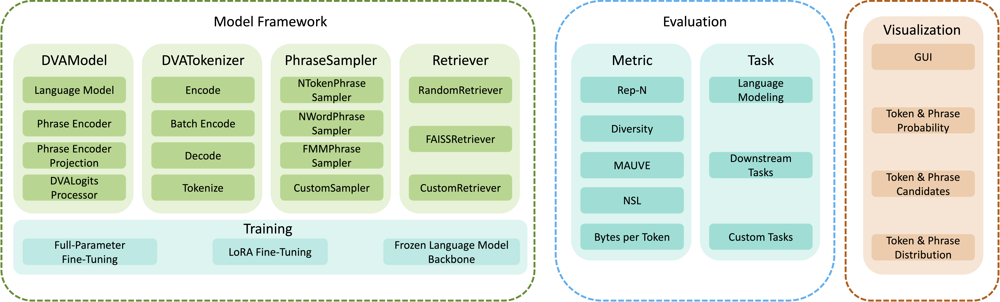

# DVAGen: Dynamic Vocabulary Augmented Generation

DVAGen is a fully open-source, unified framework designed for training, evaluation, and visualization of
dynamic vocabulary-augmented language models.



# Updates

- [2025/07/18] DVAGen v0.1.0 released!

# Quick Start

## Setup

Download the repository and install DVAGen:

```bash
git clone https://github.com/AntNLP/DVAGen.git
cd DVAGen
pip install -e .
```

Note that the `faiss-gpu` package is required if you intend to retrieve supporting documents using the GPU with `FAISSRetriever`.
`faiss-gpu` contains both GPU and CPU indices and may be incompatible with the CPU-only version (`faiss-cpu`).
 For further information, please refer to the [FAISS documentation](https://github.com/facebookresearch/faiss/blob/main/INSTALL.md).

## Inference and Training with DVAGen

Use the following command to launch a CLI or WebUI tool for chatting.

```bash
dvagen chat --config_path examples/chat.yaml
```

To evaluate a model on various tasks, use the following command:

```bash
dvagen eval --config_path examples/eval.yaml
```

By default, we use `deepspeed` to launch the training script. To train a model, use the following command:

```bash
dvagen train [deepspeed_args] --config_path examples/train.yaml
```
An example for training command.
```bash
dvagen train --num_gpus 1 \
             --num_nodes 1 \
             --master_addr "localhost" \
             --master_port 9901 \
             --config_path examples/train.yaml
```

Details of the configuration files are available in the [examples/README.md](examples/README.md) file.